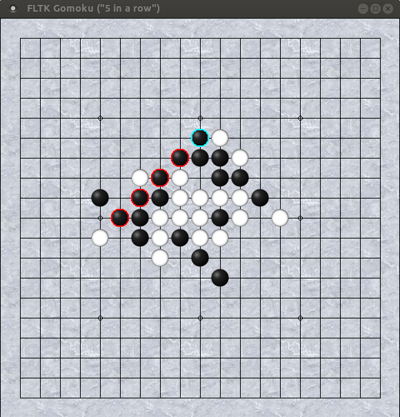

# FLTK Gomoku

*A minimal implementation of the "5 in a row" game.*

`v1.0  15/12/2017`

Requires `FLTK 1.3` or above.

Set pieces alternately (against the computer) on a
19x19 grid board.

The first one to get *exactly* five pieces in a row
of any direction (horizontal, vertical or diagonal)
wins the game.

This program currently offers only a very simple move
algorithm without levels. Nevertheless it doesn't
play too bad...

It features a resizable graphical board with an optional
background (tiled) image (if supplied as `bg.gif` in the
current directory).

Also it features pieces drawn from SVG images, so looking
nice at all scales (needs `FLTK 1.4`!).
